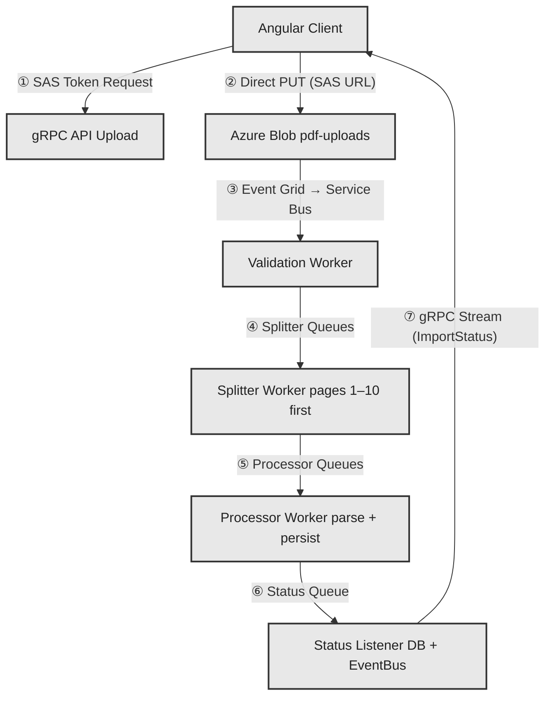
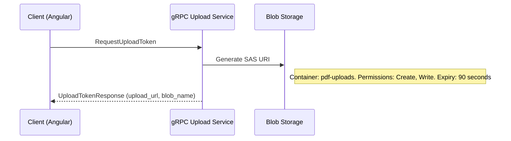
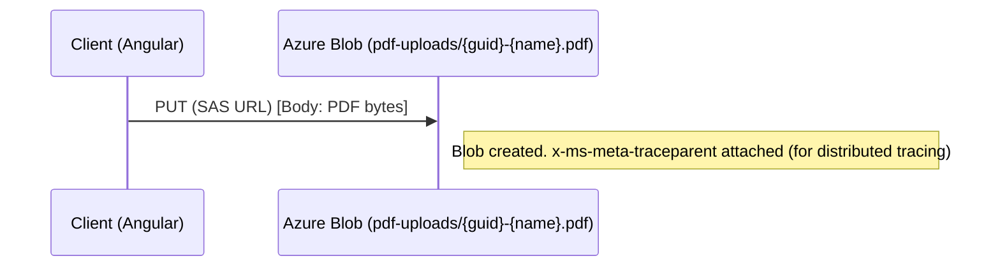
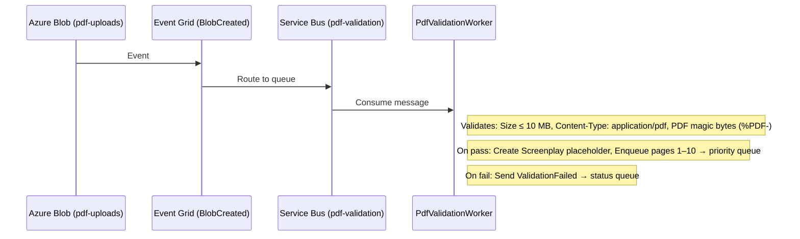
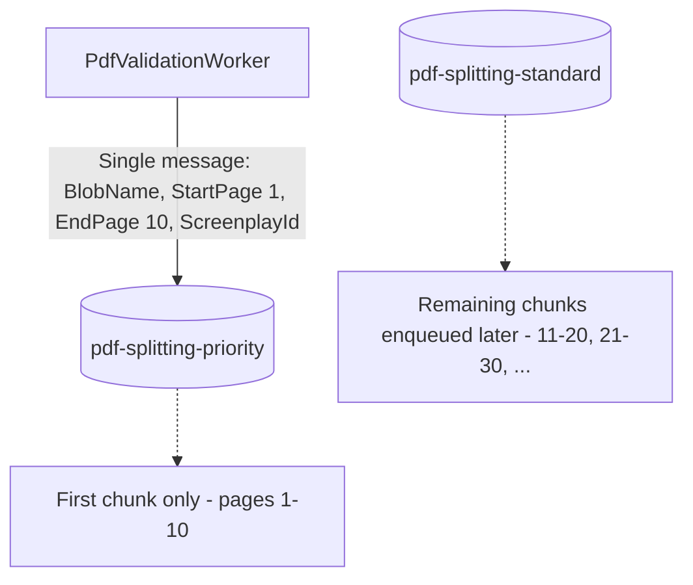
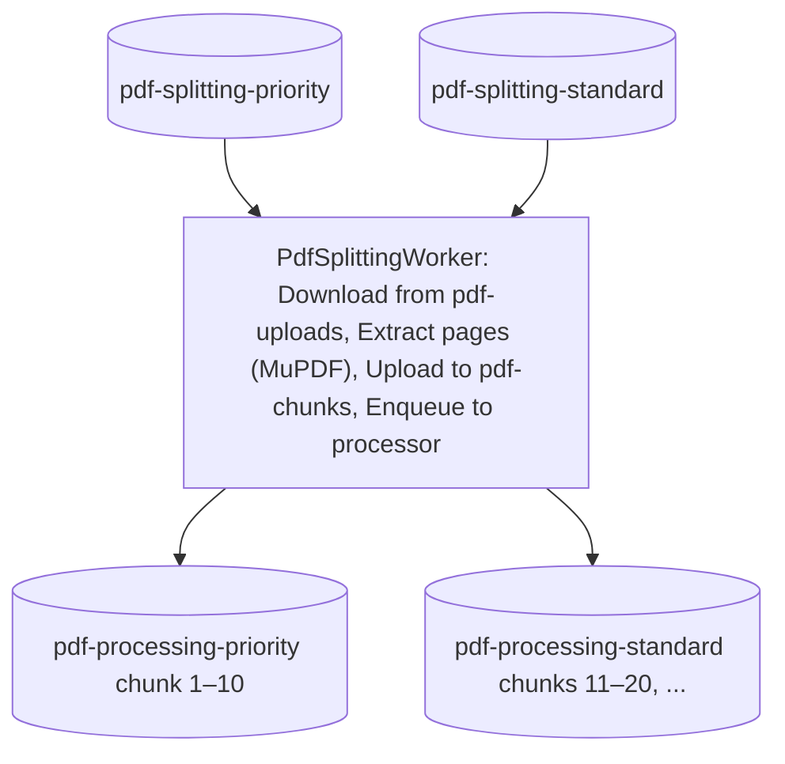
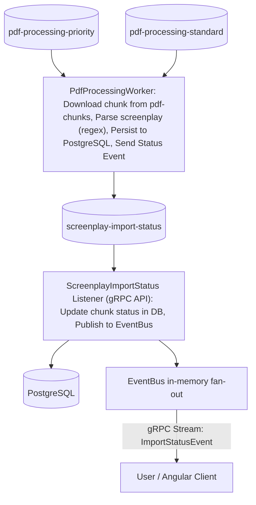
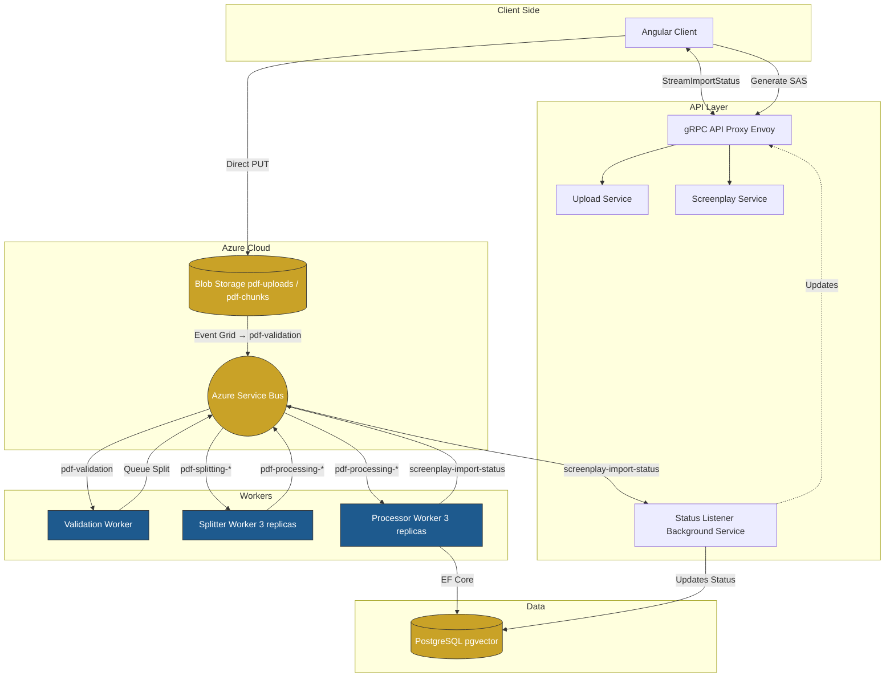

# ThePlot

**ThePlot** is a distributed screenplay import pipeline that ingests PDF screenplays, validates them, splits them into page chunks, parses scene structure (characters, locations, dialogue, action), and streams real-time import status to users. Built with .NET Aspire, it features a gRPC API, Angular frontend, PostgreSQL database, Azure Blob Storage, and Azure Service Bus.

---

## Architecture Overview

The system processes PDF uploads through a multi-stage pipeline: **upload → validation → splitting → processing → status sync**. Each stage is decoupled via queues and blob storage, enabling horizontal scaling and fast user feedback.

### High-Level Flow



---

## Detailed Architecture

### 1. Client → API: SAS Token Request

The client requests a short-lived SAS (Shared Access Signature) token from the gRPC API to upload directly to blob storage. This avoids proxying large PDFs through the API.



**Why SAS?** Direct client-to-blob upload reduces API load, improves throughput, and keeps PDF bytes off application servers.

---

### 2. Client → Blob: Direct Upload

Using the SAS URL, the client uploads the PDF with a single `PUT` request. No application server is in the path.



---

### 3. Blob → Validation Worker (Event Grid → Service Bus)

When a blob is created in `pdf-uploads`, Azure Blob Storage emits an Event Grid event that is routed to a Service Bus queue. The validation worker consumes from this queue and validates the PDF. (Locally, the worker polls the blob container directly.)



---

### 4. Validation → Splitter Queues: First 10 Pages Priority

After validation, **only pages 1–10** are enqueued to the **priority** splitter queue. Remaining pages are enqueued later by the splitter worker to the **standard** queue.



**Why split the first 10 pages first?** - **Fast time-to-content**: Users see the beginning of their screenplay quickly.  
- **Early feedback**: If parsing fails on page 1, the user learns sooner.  
- **Progressive loading**: The UI can render scenes as each chunk completes, instead of waiting for the full document.

---

### 5. Splitter Worker → Processor Queues

The splitter worker consumes from both queues, extracts page ranges using MuPDF, uploads chunks to `pdf-chunks`, and enqueues processing requests.



**Flow for first chunk (1–10):** 1. Split pages 1–10 → upload chunk blob.
2. Enqueue to `pdf-processing-priority`.
3. If total pages > 10, enqueue remaining ranges (11–20, 21–30, …) to `pdf-splitting-standard`.

**Flow for remaining chunks:** 1. Split pages N–(N+9) → upload chunk blob.
2. Enqueue to `pdf-processing-standard`.

---

### 6. Processor Worker → gRPC Service: Status Sync with DB and User

The processor worker parses each chunk, persists scenes to PostgreSQL, and sends status events to the `screenplay-import-status` queue. The gRPC API’s **ScreenplayImportStatusListener** consumes this queue, updates the DB, and pushes events to connected streaming clients.



**Status event kinds:** `BlobUploaded` → `ValidationPassed` / `ValidationFailed` → `ChunkSplitDone` → `ChunkProcessDone` / `ChunkProcessFailed` → `ImportFailed` (on terminal error)

---

## Component Diagram



---

## Data Flow Summary


| Step | From                | To                  | Protocol/Transport                             |
| ---- | ------------------- | ------------------- | ---------------------------------------------- |
| 1    | Client              | gRPC API            | gRPC `RequestUploadToken`                      |
| 2    | Client              | Blob Storage        | HTTP PUT (SAS URL)                             |
| 3    | Blob Storage        | Validation Worker   | Event Grid → Service Bus `pdf-validation`      |
| 4    | Validation Worker   | Splitter Queues     | Service Bus `pdf-splitting-priority`           |
| 5    | Splitter Worker     | Processor Queues    | Service Bus `pdf-processing-priority/standard` |
| 6    | Processor Worker    | Status Queue        | Service Bus `screenplay-import-status`         |
| 7    | Processor Worker    | PostgreSQL          | EF Core (scenes, characters, locations)        |
| 8    | Status Listener     | EventBus → Client   | gRPC `StreamImportStatus` (server streaming)   |


---

## How to start app

**Software Requirements**
- .NET 10
- Node/npm
- Docker
- [Aspire CLI](https://aspire.dev/get-started/install-cli/)


```sh
aspire run
```

In console logs, you will see a link to the Aspire dashboard. There you can access every service in the app.

## How to Deploy
**Requirements**
- Azure Subscription
- [Aspire Developer CLI](https://learn.microsoft.com/en-us/azure/developer/azure-developer-cli/)


```sh
# Provision and Deploy
azd up

# Provision only
azd provision

# Deploy only
azd deploy [optional] <APP_NAME>

# Genenerate bicep files to make modifications to deployment
azd infra gen

# Teardown
azd down
```

